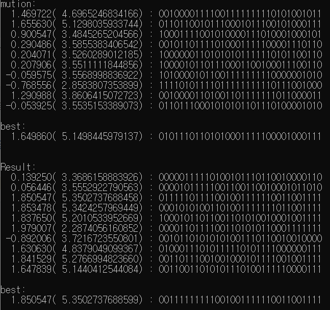
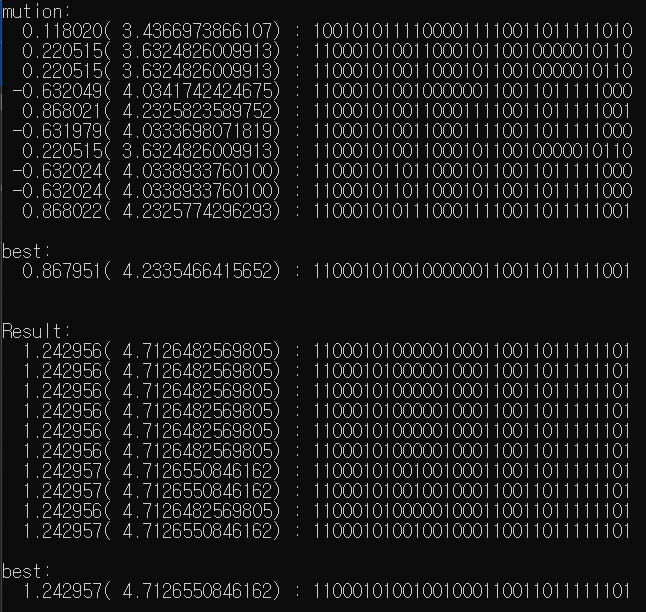
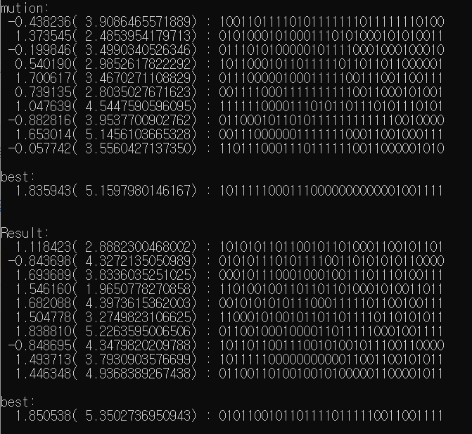
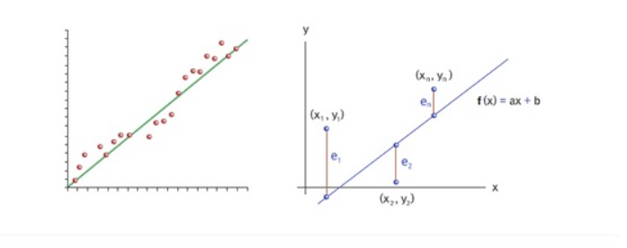
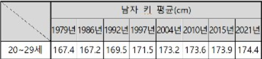
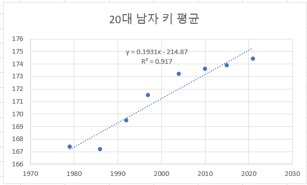

# 최적화 알고리즘을 이용한 회귀식 추정
최적화 알고리즘(유전 알고리즘)  
-----
일단 코드는 위에 파일로 올려놨습니다.  
코드를 짜긴 능력이 부족해서 코드를 보고 이해하는 쪽으로 진행했습니다.  
*유전 알고리즘* 의 기본원리는 여러 개의 해를 임의로 생성하여 이들을 초기 세대 G0으로 놓고, repeat-루프에서 현재 세대의 해로부터 다음 세대의 해를 생성해가며, 루프가 끝났을 때의 마지막 세대에서 가장 우수한 해를 리턴합니다. 이 해들은 repeat-루프의 반복적인 수행을 통해서 최적해 또는 최적해에 근접한 해가 될 수 있으므로 후보해라고 일컫습니다.  
이 유전알고리즘에서 핵심적인 부분은 현재 세대의 후보해에 대해서 3개의 연산을 통해서 다음 세대의 후보해를 생성하는 것입니다.  
3개의 연산에는
* 선택 연산
* 교차 연산
* 돌연변이 연산  
이 있습니다.   

이제 몇몇 교재에 나와있는 내용 위주로 함수를 보면서 한번 설명해보도록 하겠습니다.  

```
ga_t* ga_new(int psize, int gsize, int length)
{
	ga_t* ga;

	ga = (ga_t*)malloc(sizeof(ga_t));
	ga->newpop = pop_new(psize, gsize, length);
	ga->oldpop = pop_new(psize, gsize, length);
	ga->best = genome_new(gsize, length);
	ga->gsize = gsize;
	ga->length = length;
	ga->psize = psize;

	// default parameter 
	ga->xrate = 0.9;
	ga->mrate = 0.01;
	ga->maxgen = 10000;
	ga->maxmin = MAXIMIZE;
	ga->elitism = true;

	// default scheme 
	ga->selection = roulette_wheel;
	ga->crossover = one_point_xover;

	return ga;
}
```  
먼저 ga_t 구조체는 ga.h에 있고 그 안에 상세하게 설명되어있습니다.  
이 코드는 새로운 세대를 생성하는 함수입니다.  
매개변수는 모집단 크기, 개체의 유전자 하나의 크기, 개체의 유전자 개수로 설정하였습니다.  

```
// 룰렛휠 선별함수(선택 연산)
void roulette_wheel(pop_t* newpop, pop_t* oldpop)
{
	double* probs;
	double    sum, r;
	int i, j;

	probs = (double*)malloc(sizeof(double) * oldpop->psize);

	sum = 0.;
	for (i = 0; i < oldpop->psize; i++) {
		probs[i] = oldpop->genomes[i]->value;
		sum += probs[i];
	}

	probs[0] /= sum;
	for (i = 1; i < oldpop->psize; i++) {
		probs[i] /= sum;
		probs[i] += probs[i - 1];
	}

	for (i = 0; i < oldpop->psize; i++) {
		r = randp();
		for (j = 0; j < oldpop->psize - 1; j++) {
			if (probs[j] >= r) break;
		}
		genome_copy(newpop->genomes[i], oldpop->genomes[j]);
	}

	free(probs);
}
```
이 함수에서는 매개변수로 새로운 모집단과 이전 모집단을 받고 반복문을 통해 적합도와 적합도의 합을 이용해 계산해서 원반 면적을 구합니다.  

```
// 1 점 교차변이(교차 연산)
void one_point_xover(genome_t* dad, genome_t* mom)
{
	void* t;
	int x;
	int size;

	x = rand() % dad->length;
	size = dad->gsize * x;

	t = calloc(x, size);
	memcpy(t, dad->buff, size);
	memcpy(dad->buff, mom->buff, size);
	memcpy(mom->buff, t, size);

	free(t);
}
```  
이 함수에서는 교차변이에서 세운 부모 변수를 매개변수로 받고 교차 연산을 해줍니다.  

```
// 돌연변이
// 교차변이 단계를 거친 세대의 개체의 유전형질에 
// 주어진 돌연변이 확률로 돌연변이가 발생한다.
void ga_mutation(ga_t* ga)
{
	int i;

	for (i = 0; i < ga->psize; i++) {
		ga->mutation(ga->newpop->genomes[i], ga->mrate);
	}
}
```
돌언변이 함수에서는 매개변수로 위에 만든 세대를 매개변수로 받고 그 일부분을 임의로 변형시킵니다.  
일단 저는 main함수에서 mrate에 0.1값을 대입하면서 돌연변이 확률을 정했는데요, 교재를 보면 돌연변이 확률은 (1/모집단 크기)~(1/후보해를 이진 표현으로 했을 경우의 bit 수)라고 합니다.  
그래서 너무 작거나 너무 높거나와 한번 비교를 해보았습니다.  

* 정상
<center>
</img>
<center>  

* 너무 작은 경우
<center>
</img>
<center>  

* 너무 큰 경우
<center>
</img>
<center>  

결과를 보면 너무 작은 경우나 너무 큰 경우는 정상 경우보다 적합도가 나빠져 최적해가 더 아닐 확률이 높을 거 같습니다.  
이제 회귀식 추정에 대해 알아보겠습니다.  

회귀식 추정
---
회귀식이 일단 뭔지 검색을 해보면, 

<center>
</img>
<center> 

이런 식이라고 결과가 나옵니다. 여기서 ^은 표본으로 얻어낸 결과가 이럴 것이다라고 추리한 예측값을 의미한다고 합니다.  
보통 기울기인 b1을 먼저 구해야 한다고 합니다. 구하는 방법으로는 *최소제곱법*을 사용한다고 하는데요, 구하는 공식은 아래와 같다고 합니다.  
공식만 봤을 땐 이해가 잘 안돼서 쉽게 이해되는 걸 찾아봤습니다.  
예를 들어 함수 f(x)가 일차함수 y=a+bx일때 편차를 제곱한 것의 합이 최소가 되도록 하는 상수 a와 b를 찾는 것이 최소제곱법(최소자승법이라고도 하는 것 같습니다.) 입니다. 즉, (측정값-함수값)^2의 합이 최소가 되는 직선의 그래프를 찾는 것입니다. 다시 말해, 표시된 각 점들은 측정값 (x1, y1)이고 직선은 (x1, f(x1))은 측정값들의 분포를 가장 잘 나타내는 직선입니다.  

<center>
</img>
<center>  

통계자료
---
 <center>
</img>
<center> 
> (출처 : 한국인 평균 키 변화/표 = 산업통상자원부)  

저는 여기서 남자, 20~29세는 고정으로 두고, 독립변수는 년도이고, 종속변수는 남자 키 평균으로 두겠습니다.  
이제 엑셀에 넣고 회귀 분석을 해보았습니다.(파일은 위에 올려두았습니다.)  

 <center>
</img>
<center> 
이런 식으로 식과 제곱값이 나옵니다. 

이제 위에 설명했던 유전 알고리즘을 이용해 자료값들을 넣어서 결과값을 도출하고 엑셀에서 나왔던 것과 비교하면 될 것 같습니다.  
그런데 코드를 짜는게 쉽지 않아 완성하진 못한 거 같습니다... 죄송합니다